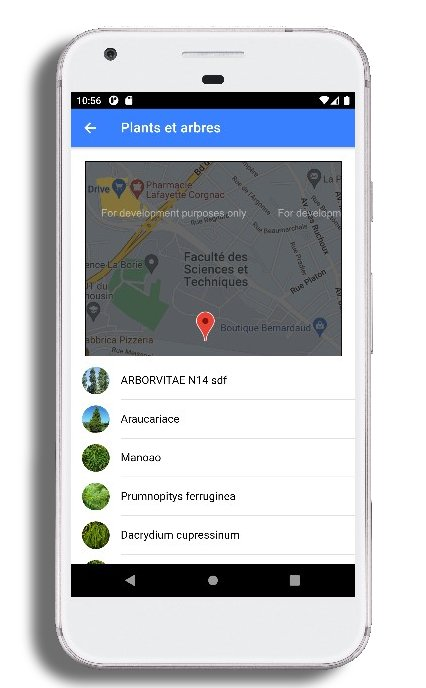

# IONIC APP 
 
 L’application mobile permettra d’accompagner les visiteurs tout au long des sentiers thématiques (Sports, family,  de l’Université de Limoges.
 
## Features

- QR code scnner which allows to open an element in a path
- Mapping to locate trails
- List of all the elements exists in each path.
- Connexions to our Nest API to fetch data

---

```

 


---

```



---

```


 
